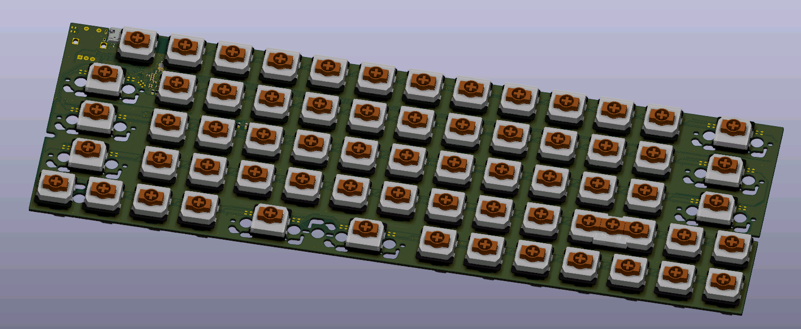

# GHEIBORD

15x5 Ortholinear low profile mechanical keyboard.

- USBC
- Bluetooth
- NRF52840
- Low profile
    - Gateron low profile
    - Kailh choc v1 & v2
    - Cherry MX
    - Redragon low profile
- all 1U and 2U
- swiss cheese PCB
- Rotary knob

## firmware

https://zmk.dev

## list

- switch socket 70pcs 1.80E https://www.aliexpress.com/item/1005004290562374.html

 
- wireless model complete https://www.aliexpress.com/item/1005005897038719.html

- mx low profile keycaps 17E https://www.aliexpress.com/item/1005004870848679.html

- mx low profile keycaps 10E https://www.aliexpress.com/item/1005004613625285.html

http://www.keyboard-layout-editor.com/##@@_a:7;&=&=0&=1&=2&=3&=4&=5&=6&=7&=8&=9&=;&@=Tab&=Q&=W&=E&=R&=T&=Y&=U&=I&=O&=P&=Back%20Space;&@=Esc&=A&=S&=D&=F&=G&=H&=J&=K&=L&=/;&=';&@=Shift&=Z&=X&=C&=V&=B&=N&=M&=,&=.&=//&=Return;&@=&=Ctrl&=Alt&=Super&=/&dArr/;&_w:2;&=&=/&uArr/;&=/&larr/;&=/&darr/;&=/&uarr/;&=/&rarr/
